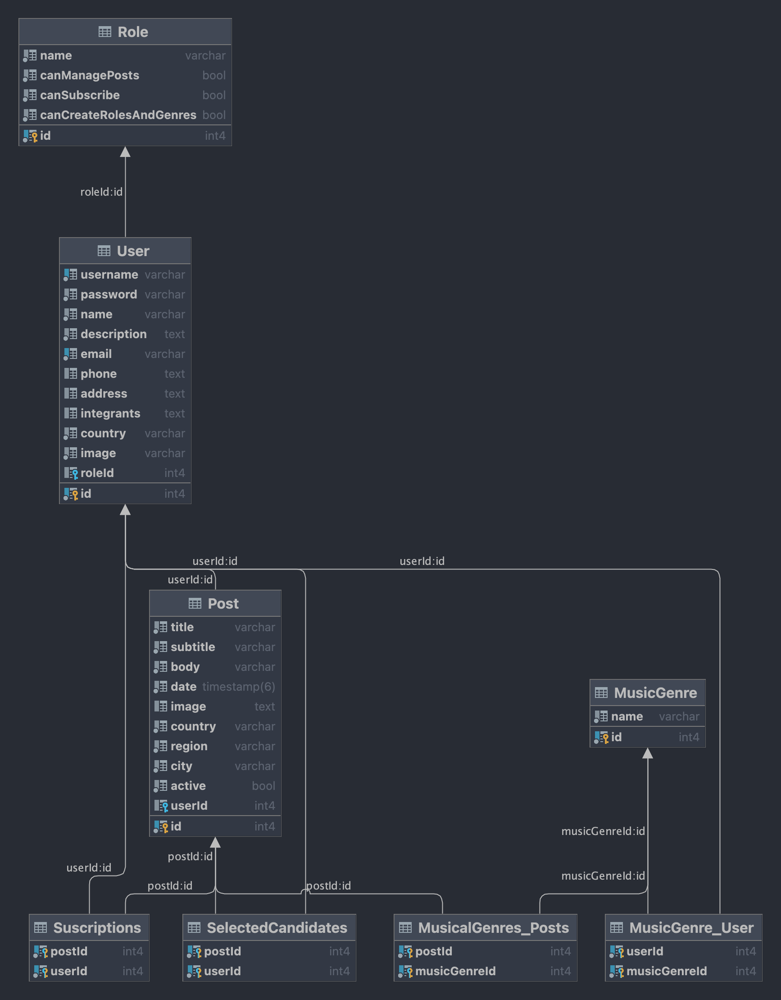

# **Find 'n Rock API**

**Content**

-   [**Quick-start**](#quick-start)
    -   [**Introduction**](#introduction)
    -   [**Use**](#use)
-   [**Technical description**](#technical-description)
    -   [**API architecture**](#api-architecture)
    -   [**Components diagram**](#components-diagram)
    -   [**Database diagram**](#database-diagram)
-   [**Time distribution**](#time-distribution)

--- 

## **Quick-start**

---

### **Introduction**

The Find 'n Rock API has been created to operate over job offers, these offers will be created by entrepreneurs or music entities and will have the rights to manage his suscribers and select the candidates that they want, these candidates will be notified once the selection cycle is completed.
Artists and music groups will be the ones that can suscribe to these job offers.

## **Installation**

In order to have the API up and running:

1. Install dependencies

```
$ npm install
```

2. Configure the .env file
    - The file is placed at the root of the project, if you just want to use it for development purposes, rename *configurationExample.env* to *dev.env*.

    - If you want to configure it to run tests, and production, you will need to create 2 more files, for testing cases create a *test.env* and for production *prod.env*.

    - If you want to choose different names, you can do it, but remember to change the *NODE_ENV* value in the *package.json* for each script that uses this renamed .env file. This is because the .env file matches with the *NODE_ENV* variable.

3. Configure Sendgrid API to be able to send e-mails
    - This API externalizes the functionality of sending emails to the SendGrid API. Only a warning will be shown in the console if it's not configured, but if you want to enable this functionality, you will need to get an API key of SendGrid and establish a verified sender which will be the one sending emails.

    - Later on, once you have the API key and the verified sender, paste it in the .env file:

```.env
## Verified sender ##
MAIL=noreply@findnrock.com

## API KEY to SMPT service ##
MAIL_API_KEY=api_key
``` 

4. This API uses Docker compose to create a database and an adminer to access easily to that database. If you want to connect to a different database, you should point to the correct host that holds the database, port, user, password and database name.

If not, the configuration example contains a valid database configuration to start, notice that in the *./docker* directory there is a *init.sql*. There you will find the SQL commands that creates 3 different databases:

- One for production (find_n_rock)
- One for development (find_n_rock_dev)
- One for testing (find_n_rock_test)

It's important to configure this init.sql if you want to create a different database name, and so on with the env file.

5. This API has different seeders, in order to make this API functional, you will need to create the appropiate roles for the users (at least for the artists and entrepreneurs).

Run the command (in this case for development):

```
$ npm run seed:dev
```

This will create all the tables, insert the roles and the music genres (found in ./app/src/static/Genres.ts) that are fundamental to use the API. This seeder will create some content to consume if you want to play around with it.

---

## **Use**

Run the command:

```
$ docker compose up
```

This will create a ./data directory that holds all the database information. Also will enable an adminer at the 8080 port.

Run the command:

```
$ npm run dev
```

You should see a prompt indicating that the connection to the database has been stablished. Then, navigate to http://localhost:3000/ to see a Swagger document to start to interact with the API.

Most of the routes are protected with a cookie or a header "auth-token", so to interact you will need to login first.

---

## **Technical description**

The architecture pattern used in this API is MVC.

MVC pattern helps to structure and manage the code in a clear and modular way, allowing to split in different sections the API flow, so on it brings several benefits:

- **Separation of concerns**: MVC promotes a clear separation between data management (model), data presentation (view), and request handling (controller), making the codebase more organized and maintainable.

- **Code reusability**: The modular structure of MVC allows components to be reused across different parts of the API. For example, models can be shared between different controllers, improving code efficiency and reducing duplication.

- **Tests**: With MVC, it's easier to write unit tests for each component independently.

---

*Find n Rock architecture*


---

*Used tecnologies*

- **Programming language**: TypeScript
- **Framework**: Express
- **Documentation/dessign tool**: Swagger
- **ORM**: TypeORM
- **Testing frameworks**: Jest, Supertest

---

*Components diagram*


---

*Database diagram*



---

## Time distribution

The inital stimated time to accomplish this project was 136 hours, but the project finished within 146 hours.


